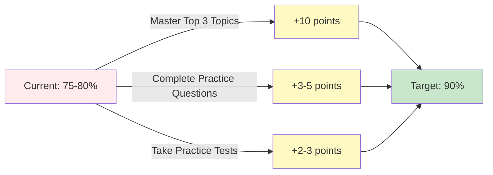

# Ross M. - Grade 8 Science Analysis & Action Plan

**Comprehensive performance analysis and personalized learning resources**

[📊 View Analysis](#overview) • [📚 Start Lessons](./lessons/00_LESSONS_INDEX.md) • [📈 Study Plan](#study-plan) • [🎯 Quick Start](#quick-start)

---

## 📑 Table of Contents

| Section | Description | Quick Link |
|---------|-------------|------------|
| 📊 **Overview** | Test performance summary | [Jump to Overview](#overview) |
| 📁 **Repository Files** | What's included in this repo | [View Files](#repository-contents) |
| 📚 **Lessons & Practice** | Interactive learning modules | [Start Learning](./lessons/00_LESSONS_INDEX.md) |
| 🎯 **Priority Areas** | Top topics to focus on | [See Priorities](#priority-study-areas) |
| 📅 **Study Schedule** | Week-by-week plan | [View Schedule](#study-plan) |
| 🚀 **Quick Start** | How to begin | [Get Started](#quick-start) |
| 📈 **Progress Tracking** | Monitor improvement | [Track Progress](#track-your-progress) |
| 🔗 **Navigation Menu** | All pages | [Full Menu](#complete-navigation) |

---

## 📊 Overview

<table>
<tr>
<td width="50%">

### 📋 Test Information
- **Tests Analyzed:** 8.10 - 8.16 (7 tests)
- **Questions Reviewed:** 40
- **Analysis Date:** March 4, 2026
- **Current Performance:** ~75-80%

</td>
<td width="50%">

### 🎯 Goals
- **Target Score:** 90%
- **Improvement Needed:** +10-15%
- **Study Timeline:** 2-3 weeks
- **Focus:** Concept mastery

</td>
</tr>
</table>

### 📊 Performance Trend

| Test | Questions to Review | Status |
|:----:|:-------------------:|:------:|
| **8.10** | 11 | 📍 Baseline |
| **8.11** | 6 | ⬆️ Strong improvement |
| **8.12** | 5 | ⬆️ Continued progress |
| **8.13** | 4 | ✅ Great momentum |
| **8.14** | 4 | ✅ Maintaining gains |
| **8.15** | 4 | ✅ Consistent |
| **8.16** | 6 | 📌 Refinement opportunity |

> **Key Insight:** Performance improved significantly from Test 8.10 → 8.13, demonstrating that concepts are learnable with focused practice!

---

## 📁 Repository Contents

### 📄 Core Analysis Files

| File | Description | When to Use |
|------|-------------|-------------|
| **[ROSS_ANALYSIS_SUMMARY.md](./ROSS_ANALYSIS_SUMMARY.md)** | ⭐ **START HERE** - Complete action plan with priorities | First read |
| **[Ross' Test Results - Sheet1.csv](./Ross'%20Test%20Results%20G8%20Science%20for%20Analysis%20-%20Sheet1.csv)** | All 40 questions with specific insights (Column D) | Reference for each question |
| **[Ross_Performance_Analysis_Report.txt](./Ross_Performance_Analysis_Report.txt)** | Detailed topic breakdowns and study plans | Deep dive |
| **[Additional_Weak_Spots_Identified.txt](./Additional_Weak_Spots_Identified.txt)** | Skill-based analysis (data interpretation, reading comprehension) | Skill development |

### 📚 Interactive Learning Materials

## [**🎓 Complete Lesson Collection**](./lessons/00_LESSONS_INDEX.md)

**10 Comprehensive Modules • 88 Practice Questions • 23 Video Tutorials**

<table>
<tr>
<th width="33%">🔴 High Priority</th>
<th width="33%">🟡 Medium Priority</th>
<th width="34%">🟢 Review</th>
</tr>
<tr>
<td valign="top">

**[1. Heat & Thermal Energy](./lessons/01_Heat_and_Thermal_Energy.md)**
- 8 questions • 3 videos
- Heat flow, evaporation

**[2. Newton's Laws](./lessons/02_Newtons_Laws_and_Forces.md)**
- 10 questions • 3 videos
- F=ma, Forces

**[3. EM Spectrum & Waves](./lessons/03_Electromagnetic_Spectrum_and_Waves.md)**
- 10 questions • 3 videos
- Radio to Gamma

</td>
<td valign="top">

**[4. Light Interactions](./lessons/04_Light_Interactions.md)**
- 10 questions • 3 videos
- Reflection, refraction

**[5. Earth-Sun-Moon](./lessons/07_Earth_Sun_Moon_System.md)**
- 10 questions • 2 videos
- Seasons, moon phases

**[6. Energy Conversions](./lessons/08_Energy_Conversions.md)**
- 10 questions • 1 video
- PE ↔ KE

**[7. Speed Calculations](./lessons/09_Speed_Calculations.md)**
- 10 questions • 1 video
- Distance/time

</td>
<td valign="top">

**[8. Genetics & DNA](./lessons/05_Genetics_and_DNA.md)**
- 10 questions • 5 videos
- DNA → protein

**[9. Electric Charges](./lessons/06_Electric_Charges.md)**
- 10 questions • 1 video
- Like/opposite charges

**[10. Antibiotic Resistance](./lessons/10_Antibiotic_Resistance.md)**
- 10 questions • 1 video
- Natural selection

</td>
</tr>
</table>

---

## 🎯 Priority Study Areas

### 📊 Opportunity Distribution

<table>
<tr>
<th>Priority</th>
<th>Topic Area</th>
<th>Questions</th>
<th>Impact</th>
<th>Action</th>
</tr>
<tr style="background-color: #ffebee;">
<td align="center">🔴</td>
<td><b>Heat & Thermal Energy</b></td>
<td align="center">8 (20%)</td>
<td align="center">⭐⭐⭐</td>
<td><a href="./lessons/01_Heat_and_Thermal_Energy.md">Start Lesson →</a></td>
</tr>
<tr style="background-color: #ffebee;">
<td align="center">🔴</td>
<td><b>Newton's Laws & Forces</b></td>
<td align="center">7 (17.5%)</td>
<td align="center">⭐⭐⭐</td>
<td><a href="./lessons/02_Newtons_Laws_and_Forces.md">Start Lesson →</a></td>
</tr>
<tr style="background-color: #ffebee;">
<td align="center">🔴</td>
<td><b>EM Spectrum & Waves</b></td>
<td align="center">5 (12.5%)</td>
<td align="center">⭐⭐⭐</td>
<td><a href="./lessons/03_Electromagnetic_Spectrum_and_Waves.md">Start Lesson →</a></td>
</tr>
<tr style="background-color: #fff8e1;">
<td align="center">🟡</td>
<td>Light Interactions</td>
<td align="center">5 (12.5%)</td>
<td align="center">⭐⭐</td>
<td><a href="./lessons/04_Light_Interactions.md">Start Lesson →</a></td>
</tr>
<tr style="background-color: #fff8e1;">
<td align="center">🟡</td>
<td>Earth-Sun-Moon System</td>
<td align="center">4 (10%)</td>
<td align="center">⭐⭐</td>
<td><a href="./lessons/07_Earth_Sun_Moon_System.md">Start Lesson →</a></td>
</tr>
<tr style="background-color: #e8f5e9;">
<td align="center">🟢</td>
<td>Genetics & DNA</td>
<td align="center">3 (7.5%)</td>
<td align="center">⭐</td>
<td><a href="./lessons/05_Genetics_and_DNA.md">Start Lesson →</a></td>
</tr>
<tr style="background-color: #e8f5e9;">
<td align="center">🟢</td>
<td>Electric Charges</td>
<td align="center">3 (7.5%)</td>
<td align="center">⭐</td>
<td><a href="./lessons/06_Electric_Charges.md">Start Lesson →</a></td>
</tr>
</table>

> **💡 Pro Tip:** Mastering the Top 3 (🔴 High Priority) topics addresses 50% of all review opportunities!

---

## 📅 Study Plan

### 📆 Two-Week Intensive Schedule

<table>
<tr>
<th colspan="2">Week 1: Foundation Building (Top 3 Priority Topics)</th>
</tr>
<tr>
<td width="25%"><b>📅 Days 1-2</b></td>
<td>
<b>Heat & Thermal Energy</b> 
• Watch 3 videos 
• Complete lesson + 8 practice questions 
• Create flashcards from Quick Reference Card
</td>
</tr>
<tr>
<td><b>📅 Days 3-4</b></td>
<td>
<b>Newton's Laws & Forces</b> 
• Watch 3 videos 
• Complete lesson + 10 practice questions 
• Practice F=ma calculations
</td>
</tr>
<tr>
<td><b>📅 Days 5-6</b></td>
<td>
<b>Electromagnetic Spectrum & Waves</b> 
• Watch 3 videos 
• Complete lesson + 10 practice questions 
• Memorize EM spectrum order
</td>
</tr>
<tr>
<td><b>📅 Day 7</b></td>
<td>
<b>Review & Light Interactions</b> 
• Complete Light Interactions lesson 
• Review all Week 1 topics 
• Self-quiz on key concepts
</td>
</tr>
<tr>
<th colspan="2">Week 2: Comprehensive Coverage & Practice</th>
</tr>
<tr>
<td><b>📅 Days 8-9</b></td>
<td><b>Genetics & Electric Charges</b> - Complete both lessons</td>
</tr>
<tr>
<td><b>📅 Days 10-11</b></td>
<td><b>Earth Science & Energy</b> - Complete both lessons</td>
</tr>
<tr>
<td><b>📅 Days 12-13</b></td>
<td><b>Speed & Antibiotic Resistance</b> - Complete both lessons</td>
</tr>
<tr>
<td><b>📅 Day 14</b></td>
<td>
<b>Full Practice Test</b> 
• Timed test simulation 
• Review all questions (including correct answers) 
• Identify remaining gaps
</td>
</tr>
</table>

### ⏱️ Daily Time Commitment

| Activity | Time |
|----------|------|
| Video watching | 15-20 min |
| Lesson reading | 20-25 min |
| Practice questions | 20-30 min |
| Review & notes | 10-15 min |
| **Total per day** | **~60-90 min** |

---

## 🚀 Quick Start

### 🎯 Three Steps to Success

<table>
<tr>
<td width="33%" align="center">

### 1️⃣ Read Analysis
**5 minutes**

📄 [ROSS_ANALYSIS_SUMMARY.md](./ROSS_ANALYSIS_SUMMARY.md)

Understand your strengths and opportunities

</td>
<td width="34%" align="center">

### 2️⃣ Start Learning
**60 minutes**

📚 [Lesson 1: Heat & Thermal Energy](./lessons/01_Heat_and_Thermal_Energy.md)

Watch videos, read, practice

</td>
<td width="33%" align="center">

### 3️⃣ Track Progress
**Ongoing**

✅ Use checklists in each lesson

Mark completed topics

</td>
</tr>
</table>

### 🎓 Learning Features in Every Lesson

<table>
<tr>
<td width="50%">

**📖 Educational Content**
- ✅ Key concepts explained clearly
- ✅ Common mistakes to avoid
- ✅ Visual diagrams and examples
- ✅ Real-world applications

</td>
<td width="50%">

**🎯 Practice & Assessment**
- ✅ Practice MCQs with solutions
- ✅ Video tutorials embedded
- ✅ Quick reference cards
- ✅ Self-check quizzes

</td>
</tr>
</table>

---

## 📈 Track Your Progress

### ✅ Lesson Completion Checklist

<table>
<tr>
<th>Priority</th>
<th>Lesson</th>
<th>Status</th>
<th>Score</th>
</tr>
<tr style="background-color: #ffebee;">
<td align="center">🔴</td>
<td><a href="./lessons/01_Heat_and_Thermal_Energy.md">Heat & Thermal Energy</a></td>
<td>⬜ Not Started</td>
<td>__ / 8</td>
</tr>
<tr style="background-color: #ffebee;">
<td align="center">🔴</td>
<td><a href="./lessons/02_Newtons_Laws_and_Forces.md">Newton's Laws & Forces</a></td>
<td>⬜ Not Started</td>
<td>__ / 10</td>
</tr>
<tr style="background-color: #ffebee;">
<td align="center">🔴</td>
<td><a href="./lessons/03_Electromagnetic_Spectrum_and_Waves.md">EM Spectrum & Waves</a></td>
<td>⬜ Not Started</td>
<td>__ / 10</td>
</tr>
<tr style="background-color: #fff8e1;">
<td align="center">🟡</td>
<td><a href="./lessons/04_Light_Interactions.md">Light Interactions</a></td>
<td>⬜ Not Started</td>
<td>__ / 10</td>
</tr>
<tr style="background-color: #fff8e1;">
<td align="center">🟡</td>
<td><a href="./lessons/07_Earth_Sun_Moon_System.md">Earth-Sun-Moon System</a></td>
<td>⬜ Not Started</td>
<td>__ / 10</td>
</tr>
<tr style="background-color: #fff8e1;">
<td align="center">🟡</td>
<td><a href="./lessons/08_Energy_Conversions.md">Energy Conversions</a></td>
<td>⬜ Not Started</td>
<td>__ / 10</td>
</tr>
<tr style="background-color: #fff8e1;">
<td align="center">🟡</td>
<td><a href="./lessons/09_Speed_Calculations.md">Speed Calculations</a></td>
<td>⬜ Not Started</td>
<td>__ / 10</td>
</tr>
<tr style="background-color: #e8f5e9;">
<td align="center">🟢</td>
<td><a href="./lessons/05_Genetics_and_DNA.md">Genetics & DNA</a></td>
<td>⬜ Not Started</td>
<td>__ / 10</td>
</tr>
<tr style="background-color: #e8f5e9;">
<td align="center">🟢</td>
<td><a href="./lessons/06_Electric_Charges.md">Electric Charges</a></td>
<td>⬜ Not Started</td>
<td>__ / 10</td>
</tr>
<tr style="background-color: #e8f5e9;">
<td align="center">🟢</td>
<td><a href="./lessons/10_Antibiotic_Resistance.md">Antibiotic Resistance</a></td>
<td>⬜ Not Started</td>
<td>__ / 10</td>
</tr>
<tr style="background-color: #e3f2fd;">
<td colspan="2" align="right"><b>Total Progress</b></td>
<td><b>__ / 10</b></td>
<td><b>__ / 88</b></td>
</tr>
</table>

---

## 📊 Resources Summary

<table>
<tr>
<th>Resource Type</th>
<th>Quantity</th>
<th>Description</th>
</tr>
<tr>
<td>📚 <b>Lesson Modules</b></td>
<td align="center">10</td>
<td>Comprehensive lessons covering all identified topics</td>
</tr>
<tr>
<td>❓ <b>Practice Questions</b></td>
<td align="center">88</td>
<td>MCQs with detailed explanations</td>
</tr>
<tr>
<td>🎥 <b>Video Tutorials</b></td>
<td align="center">23</td>
<td>Curated videos from Khan Academy and educational sources</td>
</tr>
<tr>
<td>📄 <b>Analysis Reports</b></td>
<td align="center">4</td>
<td>Detailed performance analysis and recommendations</td>
</tr>
<tr>
<td>📋 <b>Quick Reference Cards</b></td>
<td align="center">10</td>
<td>One-page summaries for each topic</td>
</tr>
<tr>
<td>✅ <b>Self-Check Quizzes</b></td>
<td align="center">10</td>
<td>Readiness assessments for each lesson</td>
</tr>
</table>

---

## 🎯 Path to 90%

<table>
<tr>
<td width="33%" align="center">

### 📍 Current
**75-80%**

Starting baseline with clear opportunities identified

</td>
<td width="34%" align="center">

### 🎯 Target
**90%**

Achievable with focused study on priority topics

</td>
<td width="33%" align="center">

### 📈 Timeline
**2-3 weeks**

Following the structured study plan

</td>
</tr>
</table>

---

## 🔗 Complete Navigation

### 📂 Main Resources

| Category | Resource | Link |
|----------|----------|------|
| 📊 | **Main Analysis** | [ROSS_ANALYSIS_SUMMARY.md](./ROSS_ANALYSIS_SUMMARY.md) |
| 📚 | **Lessons Index** | [Complete Lesson Collection](./lessons/00_LESSONS_INDEX.md) |
| 📄 | **Detailed Report** | [Ross_Performance_Analysis_Report.txt](./Ross_Performance_Analysis_Report.txt) |
| 📋 | **Test Results CSV** | [Ross' Test Results with Insights](./Ross'%20Test%20Results%20G8%20Science%20for%20Analysis%20-%20Sheet1.csv) |
| 📝 | **Skill Analysis** | [Additional_Weak_Spots_Identified.txt](./Additional_Weak_Spots_Identified.txt) |

### 📚 All Lesson Modules

<b>🔴 High Priority Lessons (Click to expand)</b>

1. [Heat & Thermal Energy](./lessons/01_Heat_and_Thermal_Energy.md) - 8 questions, 3 videos
2. [Newton's Laws & Forces](./lessons/02_Newtons_Laws_and_Forces.md) - 10 questions, 3 videos
3. [Electromagnetic Spectrum & Waves](./lessons/03_Electromagnetic_Spectrum_and_Waves.md) - 10 questions, 3 videos

<b>🟡 Medium Priority Lessons (Click to expand)</b>

4. [Light Interactions](./lessons/04_Light_Interactions.md) - 10 questions, 3 videos
5. [Earth-Sun-Moon System](./lessons/07_Earth_Sun_Moon_System.md) - 10 questions, 2 videos
6. [Energy Conversions](./lessons/08_Energy_Conversions.md) - 10 questions, 1 video
7. [Speed Calculations](./lessons/09_Speed_Calculations.md) - 10 questions, 1 video

<b>🟢 Review Lessons (Click to expand)</b>

8. [Genetics & DNA](./lessons/05_Genetics_and_DNA.md) - 10 questions, 5 videos
9. [Electric Charges](./lessons/06_Electric_Charges.md) - 10 questions, 1 video
10. [Antibiotic Resistance](./lessons/10_Antibiotic_Resistance.md) - 10 questions, 1 video

---

## 💡 Key Success Factors

<table>
<tr>
<td width="50%">

### ✅ Do This
- ✓ Follow the study schedule
- ✓ Watch ALL videos
- ✓ Complete EVERY practice question
- ✓ Read answer explanations (even for correct answers)
- ✓ Use Quick Reference Cards for review
- ✓ Take notes and make flashcards
- ✓ Practice consistently (daily is better than cramming)

</td>
<td width="50%">

### ⚠️ Avoid This
- ✗ Skipping high priority topics
- ✗ Only reading without practicing
- ✗ Rushing through lessons
- ✗ Not reviewing wrong answers
- ✗ Studying random topics without a plan
- ✗ Procrastinating practice tests

</td>
</tr>
</table>

---

## 📞 Support & Questions

<table>
<tr>
<td align="center" width="33%">

### 📧 Need Help?
Review the [Main Analysis](./ROSS_ANALYSIS_SUMMARY.md) for detailed guidance

</td>
<td align="center" width="34%">

### 🔄 Track Progress
Use the checklists in each lesson to monitor completion

</td>
<td align="center" width="33%">

### 🎯 Stay Focused
Prioritize High Priority topics in Week 1

</td>
</tr>
</table>

---

## 🌟 You've Got This!

**Every concept mastered brings you closer to your 90% goal**

---

*Analysis completed: March 4, 2026*

**Repository maintained by:** Science Education Team

